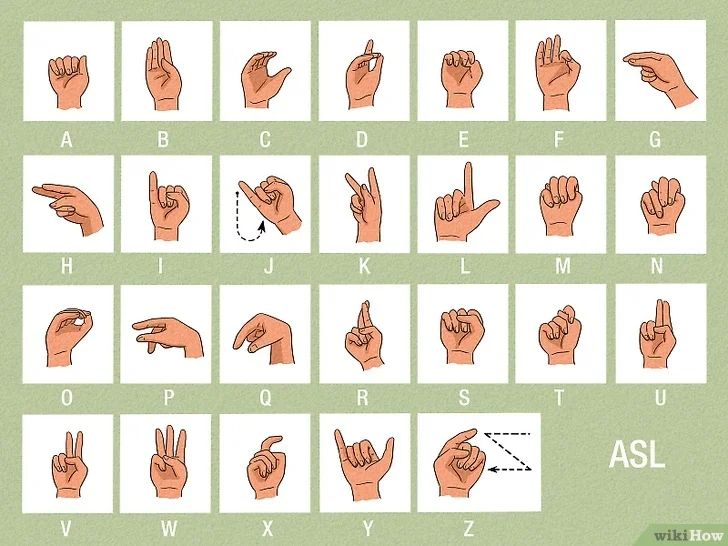
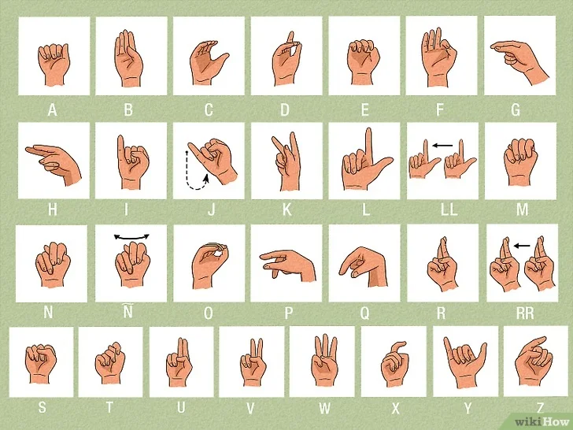

# Hand Sign multilingual

| Language               |     |
| ---------------------- | --- |
| American Sign Language | ASL |
| French Sign Language   | FSL |
| Spanish Sign Language  | SSL |


- [x] American Sign Language (ASL) from [@syauqy](https://github.com/syauqy)
- [x] Spanish Sign Language (SSL)
- [ ] French Sign Language family
- [ ] Russian Sign Language cluster
- [ ] Czech Sign Language cluster
- [ ] Danish Sign Language family
- [ ] Swedish Sign Language family
- [ ] German Sign Language family
- [ ] Vietnamese sign languages & some Thai and Lao SLs
- [ ] Arab sign-language family
- [ ] Indo-Pakistani Sign Language
- [ ] Chinese Sign Language
- [ ] Japanese Sign Language family
- [ ] BANZSL family (British, Australian and New Zealand Sign Language)
- [ ] South African Sign Language (within the BANZSL family)
- [ ] Isolated languages
- No data

## Example

```js
import * as handsignMultiligual from 'handsign-multilingual'
import * as handPoseDetection from '@tensorflow-models/hand-pose-detection'

// INIT
const { HandSignsSSL } = handsignMultiligual
const signs = Object.values(HandSignsSSL.signs)
const _GE = new fp.GestureEstimator([
    ...signs
])
const model = handPoseDetection.SupportedModels.MediaPipeHands
const detectorConfig = {
    runtime     : 'mediapipe', // or 'tfjs',
    solutionPath: 'https://cdn.jsdelivr.net/npm/@mediapipe/hands',
    modelType   : 'full'
}
const _modelDetector = await handPoseDetection.createDetector(model, detectorConfig)

// PREDICTIONS
const predictions_hands = await _modelDetector.estimateHands(input)

// Render
const font = '16px Roboto'
predictions.forEach((hand) => {
    const landmark = hand.keypoints.map(({x,y,z})=>[x,y,z])
    _drawFinger(ctx, landmark)
    const landmark3D = hand.keypoints3D.map(({x,y,z})=>[x,y,z])
    const estimatedGestures = _GE.estimate(landmark3D, 8.5)
    console.log({ estimatedGestures })

    const {x, y} = hand.keypoints[0]
    const letters = estimatedGestures.gestures.map(({name})=> name)
    _drawTextBG(ctx, `${letters}`, font, x, y, 16)
})
```

---

## American Sign Language (ASL)




```js
import { HandSignsASL } from "handsign-multilingual"

const { signs } = HandSignsASL
const signs_array = Object.values(signs)

```

## Spanish Sign Language (ASL)



```js
import { HandSignsSSL } from "handsign-multilingual"

const { signs } = HandSignsSSL
const signs_array = Object.values(signs)

```

- [List of sign languages](https://en.wikipedia.org/wiki/List_of_sign_languages)
- [A Guide to Different Sign Languages Around the World](https://www.wikihow.com/Types-of-Sign-Language) 